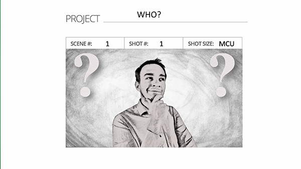
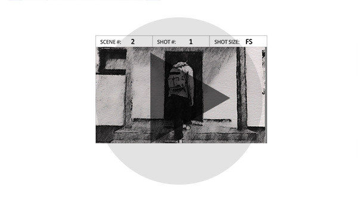
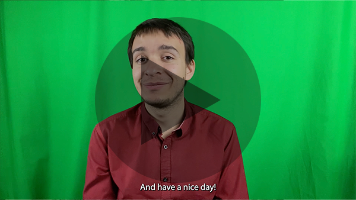

<html class= "dark">
<body>

</body>
</html>

# Summer Semester

## [The Story Behind Animation and VFX](01-storytelling-thesis-main)

## [The Story of Bachelor's Thesis Journey](02-bachelor-thesis)

----------------------------------------------------------------------------------------------

I'm glad that we had these lessons because I felt that we were actually accomplishing something – not just testing our knowledge of difficult grammar skills without improvement. In my opinion, I improved my critical thinking in presenting myself. I was greatly inspired. I'm thankful to Justin because he understood my Erasmus+ situation and allowed me to study online with others. Many thanks! I learned new basic skills in HTML using GitHub. There's not much more to say because I enjoyed Justin's teaching style. I wish him good health and lots of luck in his life.
